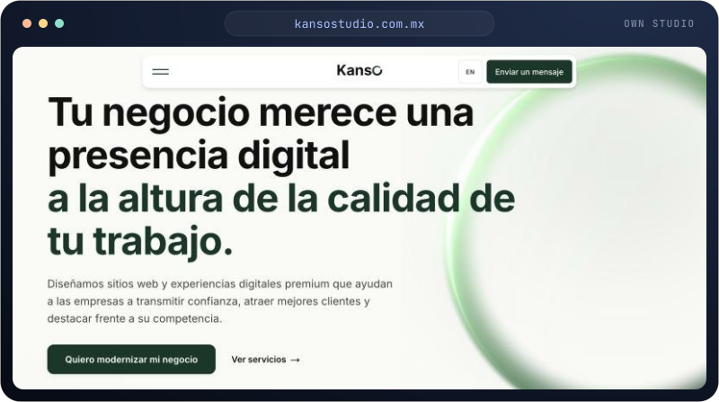
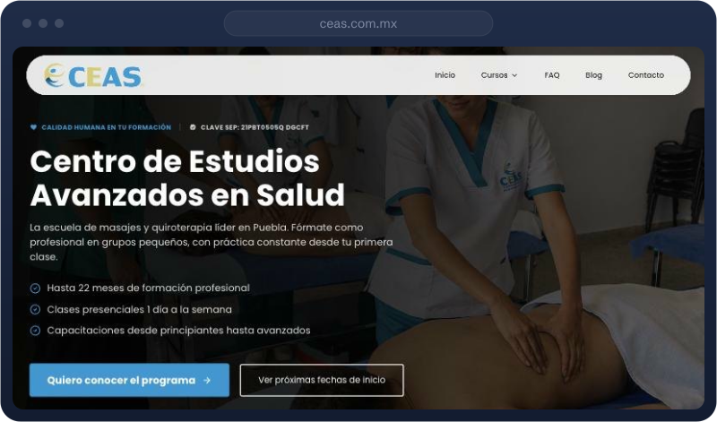
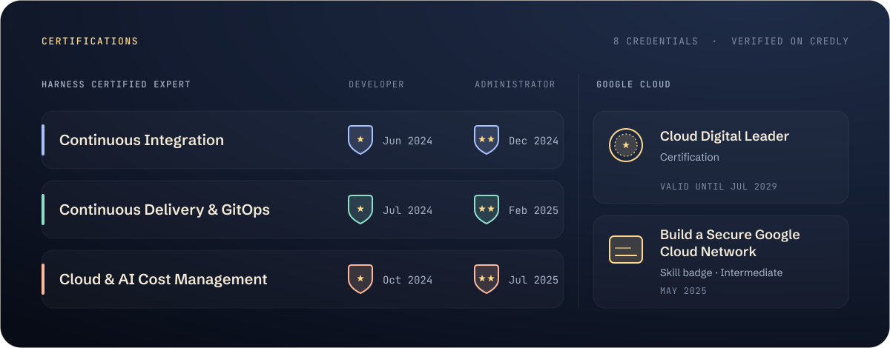
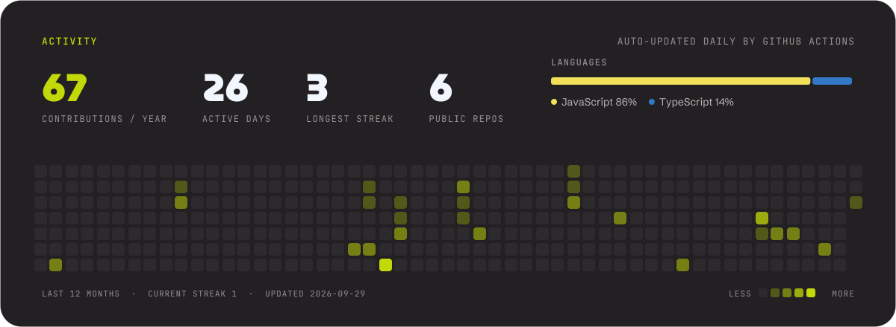

  
  
  

  I'm Jorge, a DevOps &amp; Cloud Engineer in Puebla, Mexico, and a fullstack developer who cares a lot about design. 
  By day I build CI/CD and DevSecOps pipelines on GCP and AWS. On my own time I design and ship websites for real clients.

## From interface to infrastructure

Most people pick a side of the stack. I like owning the whole path: the screen a person touches, the code behind it, and the pipeline and cloud that keep it running.

## What I do

<table>
  <tr>
    <td width="50%" valign="top">
      <h3>DevOps &amp; Cloud @ Soldig</h3>
      
Started as an intern in 2023 and grew into the role. I co-own the company's DevSecOps practice and build the pipelines that take client apps from commit to production.

      
<strong>Day to day:</strong> Harness CI/CD, security scanning in every pipeline, Terraform, Docker and Kubernetes on GKE, AWS.

    </td>
    <td width="50%" valign="top">
      <h3>Kanso Studio</h3>
      
My own design studio. I'm its founder and only member, so I cover a whole team's job: design, development, client work and launch.

      
<strong>Focus:</strong> premium websites for small and growing businesses in Mexico, and the automation behind them.

    </td>
  </tr>
</table>

## Selected work

<table>
  <tr>
    <td width="50%" valign="top">
      
      <h3><a href="https://www.kansostudio.com.mx">Kanso Studio</a></h3>
      
The studio's own site, and its first proof of quality: if the site doesn't feel premium, the pitch doesn't work. Bilingual (ES/EN) and built to turn business owners into conversations.

      <ul>
        <li>Four service tiers, each with its own page story: <b>Launch</b>, <b>Elevate</b>, <b>Scale</b> and <b>Custom</b>, from a first website to bespoke software.</li>
        <li>Three conversion paths: contact form, WhatsApp and a free <i>express audit</i> that promises 5 concrete fixes within 48 hours.</li>
        <li>Brand, copy system and motion designed from scratch, including a WebGL orb and GSAP-driven transitions.</li>
      </ul>
      
Next.js 16 · React 19 · GSAP · Framer Motion · OGL · Resend · Vercel

    </td>
    <td width="50%" valign="top">
      
      <h3><a href="https://www.ceas.com.mx">CEAS</a> · <a href="https://github.com/Jorgi1-1/ceas-web">repo</a></h3>
      
Full redesign for a school of massage, physiotherapy and alternative health in Puebla. The path is built for enrollment: programs, then upcoming start dates, then contact.

      <ul>
        <li>Course catalog, start-date calendar, blog and photo gallery.</li>
        <li>Admin dashboard so the school edits its own blog and site settings: Firebase Auth, and Firestore rules that let a single authorized account write while the public site reads without login.</li>
        <li>Validated contact form (React Hook Form + Zod), responsive from phone to desktop, and analytics.</li>
      </ul>
      
Next.js 16 · TypeScript · Tailwind v4 · Firebase · GSAP · Vercel

    </td>
  </tr>
</table>

<b>More projects</b>

 

| Project | What it is | Stack |
| --- | --- | --- |
| [cades-checker](https://github.com/Jorgi1-1/cades-checker) | Inverted QR attendance: each member's phone shows a signed, expiring QR code that organizers scan. | Next.js · Firebase · Tailwind |
| [jobcron](https://github.com/Jorgi1-1/jobcron) | Bot that checks company career pages twice a day, filters relevant roles and emails a digest. No duplicates, zero infra cost. | TypeScript · scheduled jobs |
| [SistemaGestionSalud](https://github.com/Jorgi1-1/SistemaGestionSalud) | Campus health platform: students book appointments; doctors manage schedules and clinical records with audit logs. | JavaScript |

## Stack

   
  

<table align="center">
  <tr><td><strong>Infrastructure &amp; DevOps</strong></td><td>Harness CI/CD · GitHub Actions · Terraform · Docker · Kubernetes (GKE) · GCP · AWS</td></tr>
  <tr><td><strong>Security</strong></td><td>DevSecOps pipelines · automated scanning · quality gates</td></tr>
  <tr><td><strong>Frontend &amp; design</strong></td><td>Next.js · React · TypeScript · Tailwind · GSAP · Motion · Figma</td></tr>
  <tr><td><strong>Backend &amp; data</strong></td><td>Node.js · PostgreSQL · MongoDB · Firebase · Supabase · Python</td></tr>
</table>

## Certifications

## Activity

This card isn't a third-party widget. A <a href="./.github/workflows/refresh-activity.yml">scheduled workflow</a> queries the GitHub GraphQL API every night, renders the SVG with <a href="./scripts">a small Python script</a> and commits it back.

## Let's talk

Open to full-time roles and freelance projects, remote or in Mexico. LinkedIn is the fastest way to reach me.

  
  

